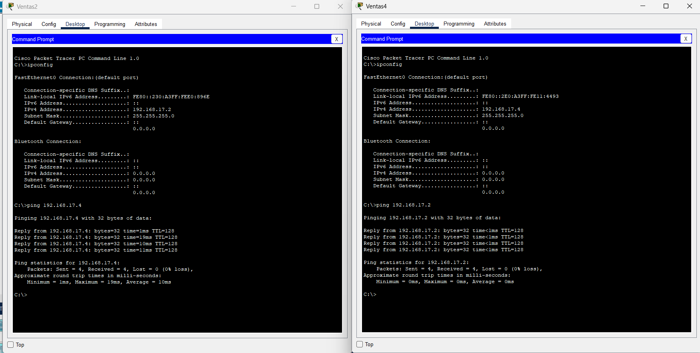

# REDES1_1S2025G24

## Capturas de Áreas:

### Administración y Recepción:

### Infraestructura:

### Gerencia:

### Desarrollo:

## Tabla de IPs:
| Área            |     Nombre        | Dirección IP    |
|-----------------|-------------------|-----------------|
| Recepción       | Recepcion 1       | 192.168.57.1    |
| Recepción       | Recepcion 2       | 192.168.57.2    |
| Recepción       | Recepcion 3       | 192.168.57.3    |
| Recepción       | Recepcion 4       | 192.168.57.4    |
| Administración  | Gerencia 1        | 192.168.37.1    |
| Administración  | Gerencia 2        | 192.168.37.2    |
| Administración  | Ventas 1          | 192.168.17.1    |
| Administración  | Ventas 5          | 192.168.17.5    |
| Administración  | Seguridad 1       | 192.168.47.1    |
| Administración  | Soporte Tecnico 1 | 192.168.27.1    |
| Infraestructura | Seguridad 5       | 192.168.47.20   |
| Infraestructura | Soporte Tecnico 4 | 192.168.27.4    |
| Infraestructura | Ventas 4          | 192.168.17.4    |
| Infraestructura | Seguridad 6       | 192.168.47.21   |
| Gerencia        | Seguridad 3       | 192.168.47.3    |
| Gerencia        | Gerencia 3        | 192.168.37.3    |
| Gerencia        | Soporte Tecnico 5 | 192.168.27.5    |
| Gerencia        | Gerencia 4        | 192.168.37.4    |
| Desarrollo      | Seguridad 2       | 192.168.47.2    |
| Desarrollo      | Ventas 2          | 192.168.17.2    |
| Desarrollo      | Ventas 3          | 192.168.17.3    |
| Desarrollo      | Soporte Tecnico 3 | 192.168.27.3    |
| Desarrollo      | Soporte Tecnico 2 | 192.168.27.2    |
| Desarrollo      | Seguridad 7       | 192.168.47.7    |
| Desarrollo      | Gerencia 5        | 192.168.37.5    |

## Capturas de Ping

### Ping 1

### Ping 2

### Ping 3

### Ping 4
